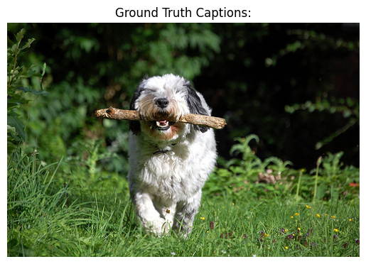

## Project Overview
This project contains a trained deep learning model for automatic image captioning.

## How to Use
1. Download both `my_caption_model.h5` and `tokenizer.pkl`.
2. Load them in your Python environment as shown below:

import tensorflow as tf
import pickle

model = tf.keras.models.load_model('my_caption_model.h5')
with open('tokenizer.pkl', 'rb') as f:
tokenizer = pickle.load(f)

3. Use the model for generating captions on new images!
## Example Output

**Generated Caption:**  
"A dog running in the park."  <!-- Replace with your model's output for this image -->

